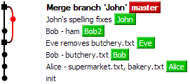

# Summary of Day 1

* A few friends are making a list what to buy for the weekend and they decided to use GIT.
* Create a folder and an empty GIT repository in it
* Commit an empty file `supermarket.txt` into master
* Create a separate branch for each person (always from latest master at the moment)
and commit his/her changes into this branch
(do the changes yourself, the names of persons are there just to identify the branches somehow)

## Alice

Alice puts this list into the file `supermarket.txt` (copy&paste it as is):

```
Buter
Egs
Millk
Salt
Yogurts
```

And adds file `bakery.txt` with this content:

```
Bread
Croissant
Donuts
Muffins
```

Merge her branch into master.

## Bob

Bob adds a new file `butchery.txt` with this content:

```
Bacon
Chicken
Ham
```

Merge his branch into master.

## Eve

Eve is vegetarian, so she deletes `butchery.txt`. Merge her branch into master.

## John

John fixes spelling in `supermarket.txt`:

```
Buter -> Butter
Eggs   -> Eggs
Millk  -> Milk
```

Commit his changes but do not merge his branch to master now.

## Bob2

Bob want to buy at least ham in the supermarket (keep the list sorted alphabetically). Merge his branch into master.

## John (same branch as before)

Merge John's changes into master (Be careful not to delete Bob's ham during the merge process).

## The Result

If you did everyting correctly, your repository should look like this:


